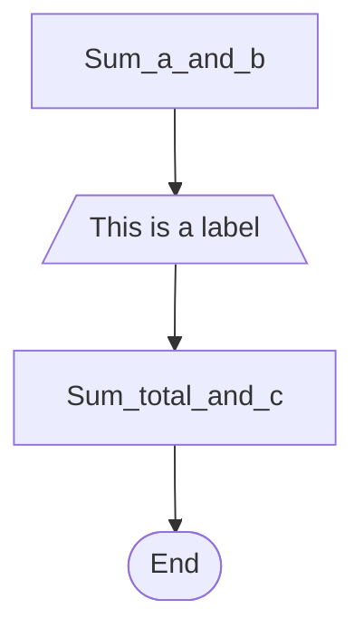
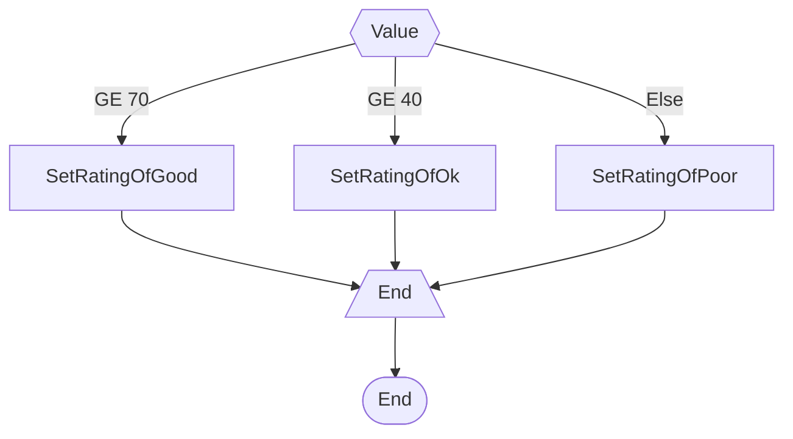
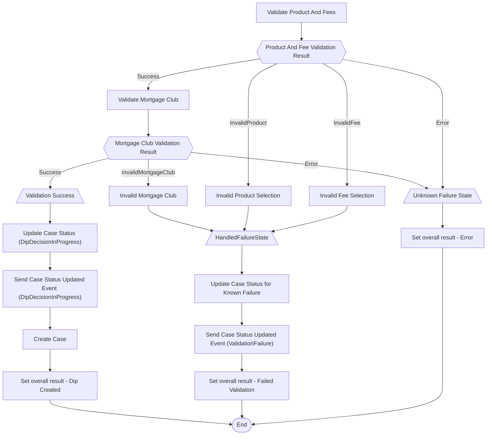

# SumFlowHandler

```mermaid
graph TB
Sum_a_and_b["Sum_a_and_b"] --> 
This_is_a_label[/"This is a label"\] --> 
Sum_total_and_c["Sum_total_and_c"] --> 
_End_([End])
```
# SwitchTestFlowHandler

```mermaid
graph TB
Value{{"Value"}} -- "GE 70" -->
SetRatingOfGood["SetRatingOfGood"] --> 
End[/"End"\] --> 
_End_([End])
Value{{"Value"}} -- "GE 40" -->
SetRatingOfOk["SetRatingOfOk"] --> 
End
Value{{"Value"}} -- "Else" -->
SetRatingOfPoor["SetRatingOfPoor"] --> 
End
```
# DipCreationHandler

```mermaid
graph TB
Validate_Product_And_Fees["Validate Product And Fees"] --> 
Product_And_Fee_Validation_Result{{"Product And Fee Validation Result"}} -- "Success" -->
Validate_Mortgage_Club["Validate Mortgage Club"] --> 
Mortgage_Club_Validation_Result{{"Mortgage Club Validation Result"}} -- "Success" -->
Validation_Success[/"Validation Success"\] --> 
Update_Case_Status__DipDecisionInProgress_["Update Case Status (DipDecisionInProgress)"] --> 
Send_Case_Status_Updated_Event__DipDecisionInProgress_["Send Case Status Updated Event (DipDecisionInProgress)"] --> 
Create_Case["Create Case"] --> 
Set_overall_result___Dip_Created["Set overall result - Dip Created"] --> 
_End_([End])
Mortgage_Club_Validation_Result{{"Mortgage Club Validation Result"}} -- "InvalidMortgageClub" -->
Invalid_Mortgage_Club["Invalid Mortgage Club"] --> 
HandledFailureState[/"HandledFailureState"\] --> 
Update_Case_Status_for_Known_Failure["Update Case Status for Known Failure"] --> 
Send_Case_Status_Updated_Event__ValidationFailure_["Send Case Status Updated Event (ValidationFailure)"] --> 
Set_overall_result___Failed_Validation["Set overall result - Failed Validation"] --> 
_End_([End])
Mortgage_Club_Validation_Result{{"Mortgage Club Validation Result"}} -- "Error" -->
Unknown_Failure_State[/"Unknown Failure State"\] --> 
Set_overall_result___Error["Set overall result - Error"] --> 
_End_([End])
Product_And_Fee_Validation_Result{{"Product And Fee Validation Result"}} -- "InvalidProduct" -->
Invalid_Product_Selection["Invalid Product Selection"] --> 
HandledFailureState
Product_And_Fee_Validation_Result{{"Product And Fee Validation Result"}} -- "InvalidFee" -->
Invalid_Fee_Selection["Invalid Fee Selection"] --> 
HandledFailureState
Product_And_Fee_Validation_Result{{"Product And Fee Validation Result"}} -- "Error" -->
Unknown_Failure_State
```
